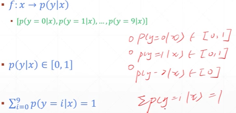

<u>本文只列出 **需要注意的知识点 以及 其他资料未涉及的细节** ，</u>

<u>其他详细内容参考 **AI算法工程师手册、DeepLearning-500-questions**</u>

## 0. 数学基础    

## 1. KNN

knn 分类与回归的使用   

- 分类：根据其 k 个最近邻的训练样本的类别,通过多数表决等方式进行预测
- 回归：根据其 k 个最近邻的训练样本标签值的均值作为预测值

knn 三要素   

- (1) k 值选择   

  -  关于超参数的选择？？
    - 领域知识 
    - 经验数值
    - 实验搜索 - 网格搜索

- (2) 距离度量

  欧氏距离、曼哈顿距离、明科夫斯基距离

- (3) 决策规则 

  

sklearn knn的使用     

## 2. 线性回归

回归则是对连续型的数据做出处理，回归的目的是预测数值型数据的目标值

### 2.1 最小二乘法

求最小化误差下的 *w*

### 2.2 衡量指标   

MSE, RMSE, MAE, $R^2$

### 2.3 多元线性回归

## 3. 梯度下降法

## 4. PCA

## 5. 多项式回归与模型泛化

## 6. 逻辑回归 

二分类问题怎么用回归解决？？

将样本特征和样本发生的概率联系起来，样本概率是一个数   

### 6.1 二分类 -Binary Classification      

- $f: --> p(y=1|x)$
  - if $p(y=1|x) > 0.5$, predict as 1
  - else predict as 0
- minmize MSE

### 6.2 多分类- Multi Classification   

由最后一项， 引入`Softmax函数`

### Keys: 回归与分类 - Goal v.s. Approach  

- Regression  

  - Goal: pred = y_truth

    目标是尽可能的使 预测值接近真值

  - Approach: minimize dist(pred, y_truth)  

- Classification

  - Goal: maxmize benchmark, e.g. accuracy

    目标是 提高评价的一些指标，像accur，AOC，但具体做法不是来优化这些benchmark，这是回归与分类的本质区别

  - Approach 1: minmize **dist$(p_{\theta}(y|x), p_{r}(y|x))$ **

    $p_{\theta}(y|x)$ --> $p_{r}(y|x)$ 

    第一项：给出x，得到一个 y 在 theta 上的条件概率分布，与第二项真实分布越接近越好

  - Approach 2: minmize **divergence$(p_{\theta}(y|x), p_{r}(y|x))$ **   

  

  

  

  

  

  

  

  

## 7.SVM

## 8. 决策树

## 9. 集成学习

## 10. 贝叶斯算法

## 11. EM算法

## 12. 聚类

## 13. 模型评估

