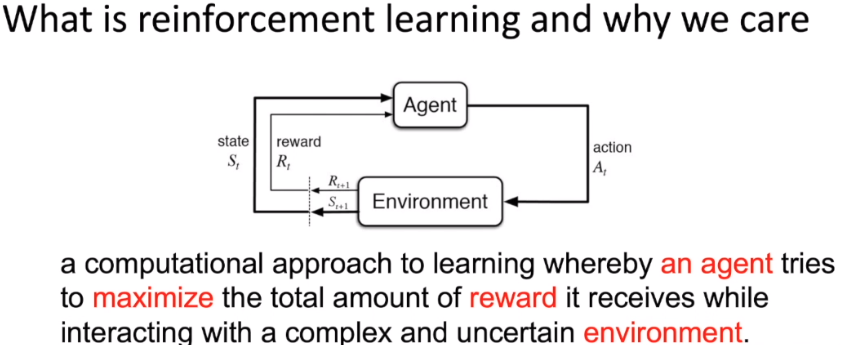

##  Intro to Reinforcement Learning / 强化学习纲要     

### ch01-Introduction-i

（1）definition：

    
agent目标：尽可能的从复杂多变的环境中，最大化能获得的奖励          
     

（2）compare with Supervised Learning: like classification:
- 已标注好的图像，数据间的关联极少，服从独立同分布（i.i.d, independent and indentically distributed）
- learner are told what the labels are. / 分类器可根据标签值来修正预测         

    

（3）difference between RL and Supervised Learning(SL):
- RL: 序列数据，之间关联性较强
- RL: learner are not told which actions to take, but instead must discover which actions yield the most reward by trying them
- RL: 不断试错 / Trial-and-error exploration(balance exploration and exploitation)
  - exploration: 尝试新的actions，尽管奖励多少未知
  - exploitation：在已经的actions中采取action，没有新的探索
- no supervisor, only a reward signal,which is also delayed         

     

（4）so, RL features:
- Trial-and-error exploration
- Delayed reward
- Times matters(序列数据的原因，无法像强监督学习一样消除数据间的关联性，训练不稳定)
- Agent's actions affect the subsequent data it recives（agent的action会改变环境，间接影响后续接收到的数据）          

       
  
### ch01-Introduction-ii
(1) agent and environment    
The agent learns to interact with the environment.          
agent在与环境的交互过程中，会产生许多的观测，agent目的：从这些观测中学到，能极大化奖励的策略                 

(2) Rewards / 奖励函数   
- A reward is scalar feedback signal
- Indicate how well agent is doing at step t
- RL is based on maximization of rewards     
所以，agent的所有目标可以概括描述为，最大化期望累计奖励(expected cumulative reward)              
      
关于奖励：
- actions may have long term consequences，会造成远期的影响
- reward may be delayed
- Trade-off between immidate reward and long-term reward
  尽可能使得agent获得长期的奖励      
     
其他点：    

（3）Agent     
组成部分：
- Policy: agent's behavior fuction
- Value function: estimate every state or action
- Model: agent's state representation of the environment      
  代表了agent对整个环境状态的一个理解，决定整个的运行       
    
Policy：       
  

 

